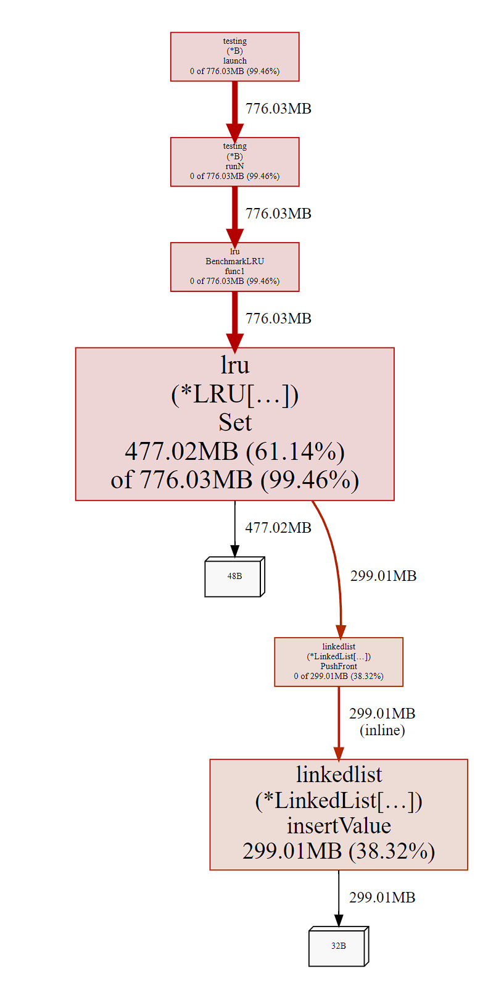

# Домашнее задание #8

1. Реализовал LRU кэш с поддержкой TTL и шардированной мапой в качестве хранилища.
Обёртка над кэшем покрыта основными метриками.

2. Бенчмарки
    ```
    $ go test -bench=. -benchmem -benchtime=10000000x
    goos: linux
    goarch: amd64
    pkg: gitlab.ozon.dev/rragusskiy/homework-1/lib/cache/lru
    cpu: AMD Ryzen 5 5600X 6-Core Processor
    BenchmarkDefaultMap/Set-12              10000000               167.8 ns/op            70 B/op          0 allocs/op
    BenchmarkDefaultMap/Get-12              10000000               48.86 ns/op             0 B/op          0 allocs/op
    BenchmarkSyncMap/Set-12                 10000000               523.6 ns/op           155 B/op          5 allocs/op
    BenchmarkSyncMap/Get-12                 10000000               148.3 ns/op             0 B/op          0 allocs/op
    BenchmarkLRU/Set-12                     10000000               224.7 ns/op            80 B/op          2 allocs/op
    BenchmarkLRU/Get-12                     10000000               63.71 ns/op             0 B/op          0 allocs/op
    PASS
    ok      gitlab.ozon.dev/rragusskiy/homework-1/lib/cache/lru     12.667s
    ```

3. Использование памяти

   