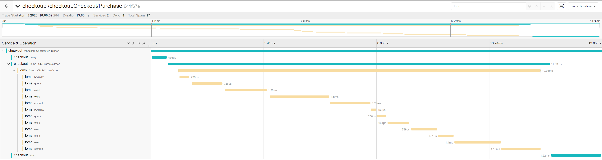
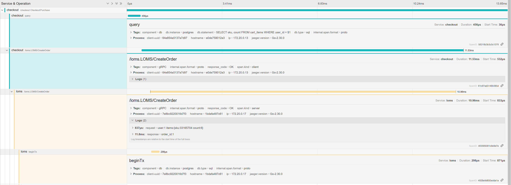
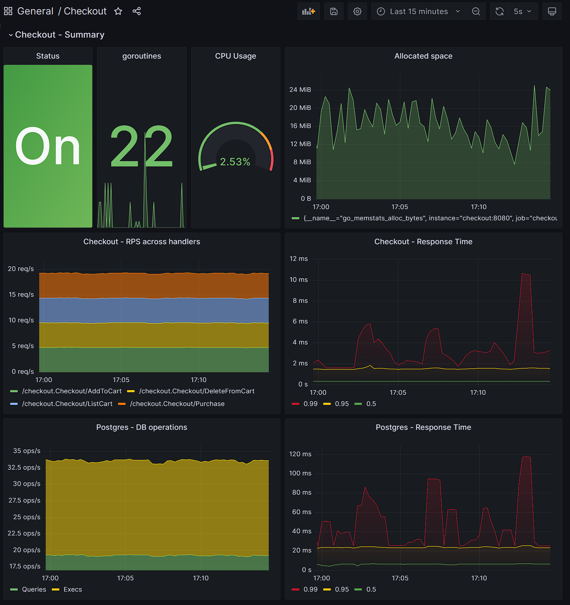
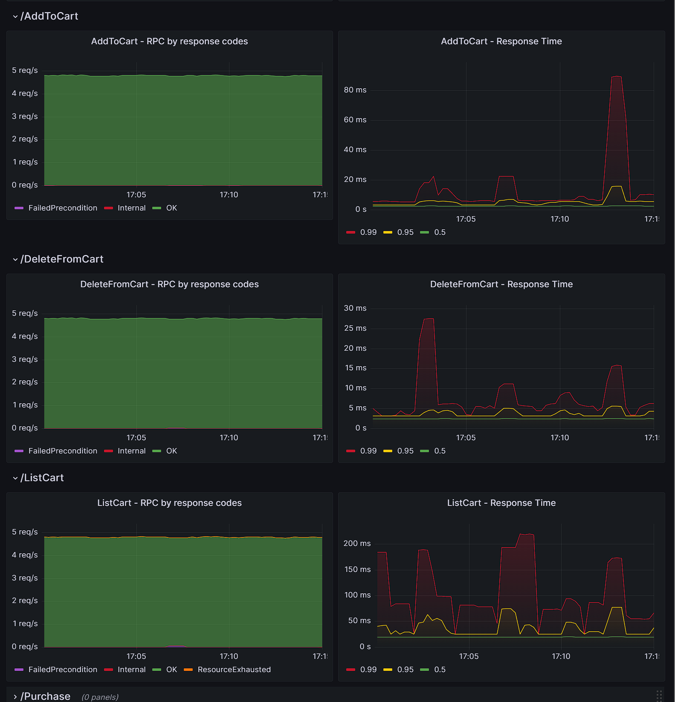
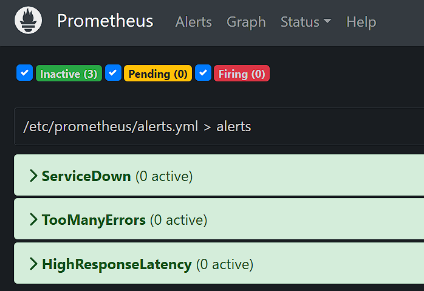
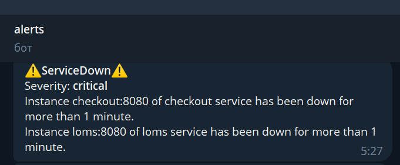

# Домашнее задание #7

1. Логи уже были структурные (zerolog), сейчас только немного изменил интерфейс и добавил больше логов.
2. Трейсами покрыл все, кроме кафки.
   
   
   

3. Метрики на gRPC серверы, клиенты и БД есть.
   
   

4. Сделал алерты в тг на падение сервисов, высокий процент ошибок и высокую задержку ответов.
   
   

5. Сделал wrapper для клиентов и интерцепторы для серверов (см. `./lib/grpc`).
6. Сделал wrapper для клиента к БД (см. `./lib/db`).